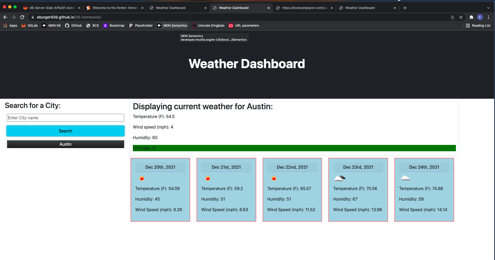

# Homework 6
* Due on 12/20/2021

## Description
* Created a weather dashboard that allows the user to search by city name and for the page to display the current weather and a 5 day forecast.  The current weather included a UV index score that changes colors based on the UV index.  The cards display the date and the weather icon for a visual of the weather description (sunny, partly cloudy, rainy, etc).

## Screen shot of final depolyed webpage

## Link to deployed application
* https://eburger939.github.io/06-homework/
